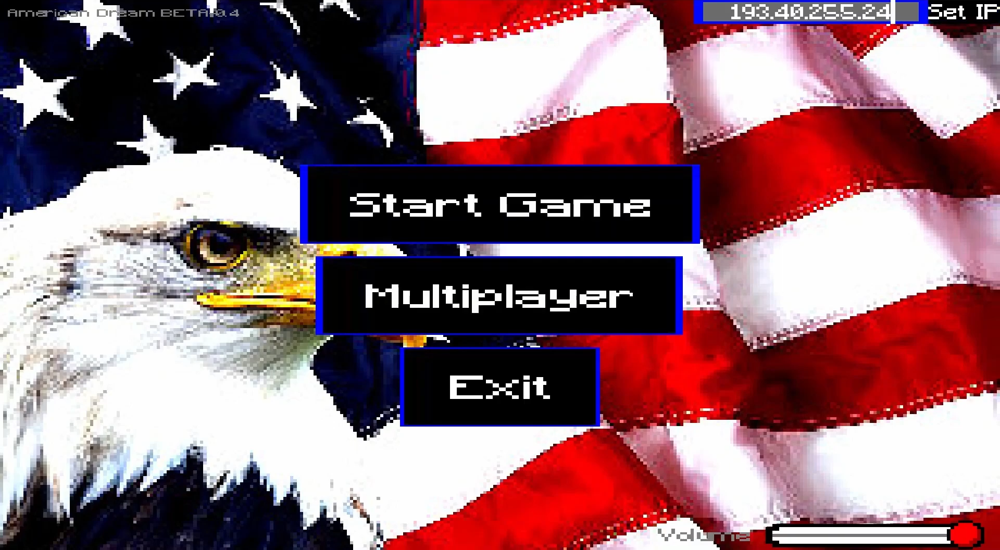
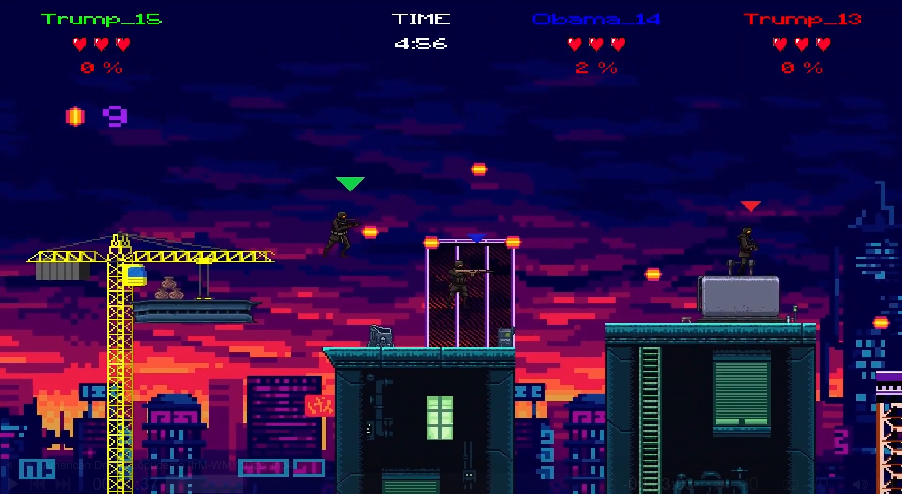
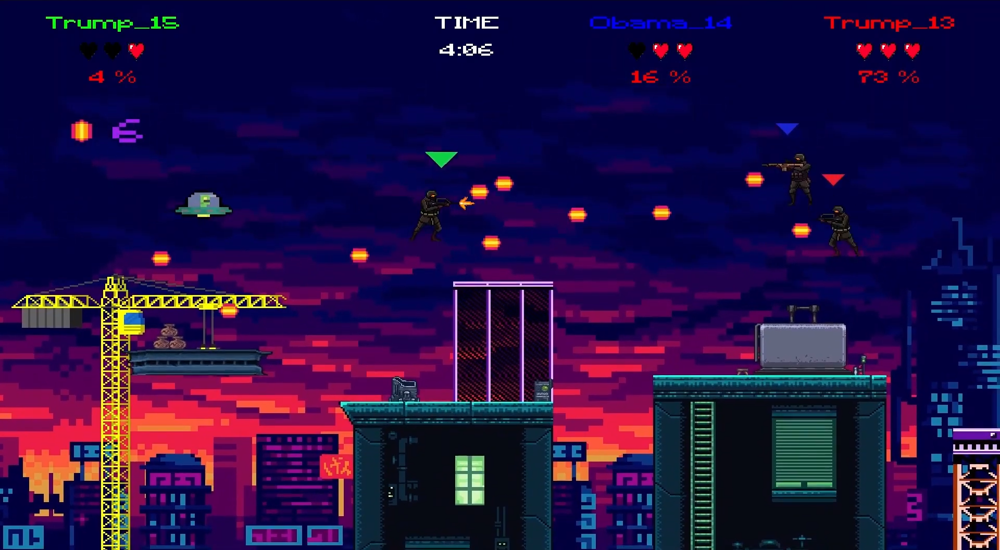
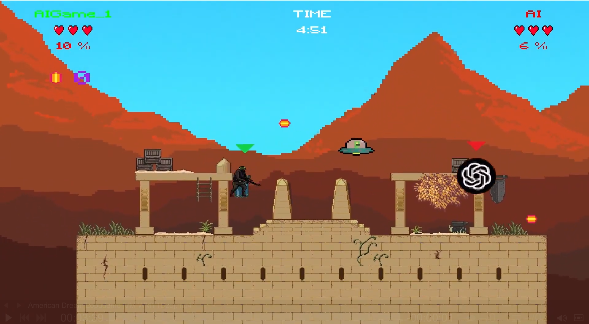

# American Dream

A 2D game similar to Super Smash Bros but with the addition of guns and the American Dream

# Images






### Running the game

Running the game is as simple as running the client jar file in jars folder. Server can be run in the same way.

```bash
java -jar desktop-$VERSION_NUMBER.jar
```

replace $VERSION_NUMBER with the version number to run.

### Playing the game

#### Multiplayer

* Open the game and press multiplayer.
* Choose a lobby from the selection.
* Choose your character
* When no map has been chosen for the current game, you can also choose a map.
* When map is selected you are in game.
* Wait for other players to join and have fun!

### Game keys

* 'Left' - Shoot bullets to the left
* 'Right' - Shoot bullets to the right
* 'A' - Move left
* 'D' - Move right
* 'W' - Jump
* 'S' (hold) - Drop through a platform
* 'N' - Spawn AI player
* 'J' - While pressed when inside gun box, get special weapon

Sidenote: the game is also playable with a controller (screens are not navigable with a controller)

### Server setup for development

Open project module named 'server' in IntelliJ.

Navigate to file 'GameServer.java' located in src directory.

Run GameServer.java if it is runnable.

If GameServer.java isn't runnable:

* Open Gradle tab (Elephant logo on the right side of the screen)
* Click 'build' located in server\Tasks\build\
* Gameserver.java should now be runnable

### Client(s) setup for development

Open project module named 'client' in IntelliJ.

Open Gradle tab (Elephant logo on the right side of the screen)

Click 'run' located in client\Tasks\other\

Click 'run' again to create an additional client for the same server

## Contributing

Rihard Rivis, Elias Markus Priinits, Rasmus Sander

## License

[MIT](https://choosealicense.com/licenses/mit/)